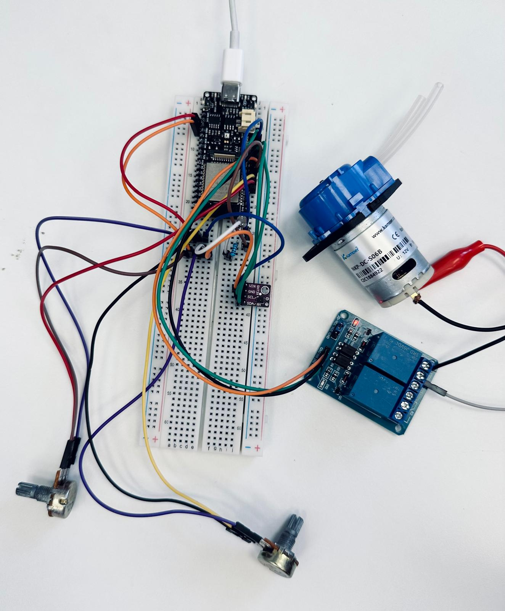

# Agrotech-Final Project- “Cutting-Edge Closed-Environment System for Monitoring Microbial Metabolism and Viability”
## Project Goal :sparkles:
Our goal is to track metabolism indicators by the use of sensors to assess microbial viability within a closed system over time, where a peristaltic pump that refreshes the air once CO₂ concentration reaches a threshold.
### System Concept
The system is equipped with a range of sensors: CO₂ , O₂ , temperature, humidity, and light intensity to track environmental conditions. Data from these sensors is transmitted to our [Thingspeak Channel](https://thingspeak.com/channels/2595959). When CO₂ levels reach a predefined threshold (1000 ppm, 400-10000 ppm range), The system automatically activates two peristaltic pumps: one to introduce fresh air into the closed environment and another to expel used air, ensuring optimal conditions for precise microbial viability assessment.
(https://github.com/vitoska26/agrotech_project/blob/main/Extras/73TI.gif)

### Components:

Electronics:

* x1 firebeetle ESP32 microcontroller 
* x1 Relays 
* x2 Peristaltic Pump 
* Multiple Cables
* x1 12V Power Source
* x1 CO₂ Sensor
* x1 O₂ Sensor
* x1 LDR (Light dependent resistor)
* x1 Resistor
* x1 SHT31 Sensor
* x2 Potentiometers

Hardware:

* x1 Plastic box
  

🚨**Disclaimers:**
* We were able to only monitor, Light, humidity and temperature. CO₂ and O₂ sensors were simulated using Potentiometers and code that set out to “fake” CO₂ and O₂ data.

# Construction:

## Prototype
The initial setup involved connecting the sensors to the ESP32 microcontroller and testing the basic functionality. and the relays were connected to control the peristaltic pumps. The system was assembled on a breadboard to validate the design before integrating it into a more permanent solution.

In addition The system as it stands lacks the integration of CO₂ and O₂ sesnors, in order to deal with that we used 2 potentiometers that are programmed to feed “fake” CO₂ and O₂ data so that we have a way to control the pumps and something to show in the presentation.
חיישני אור וטמפרטורה 
בסוך העלאה לthingpeakd

## Sketch
  * **Red** - VCC
  * **Blue** - GND for 12V components or analog read for sensors
  * **Black** - GND
  * **Orange** - VCC for sensors and analog pins for relays (also yellow)
  * **Brown** - 12V power supply or GND for relays and sensors

# Code
[Can be found here](https://github.com/Gabriella38/Agrotech-Final/blob/main/Code)

# The final outcome

Picture from the Thingspeak:

## Data analysis
