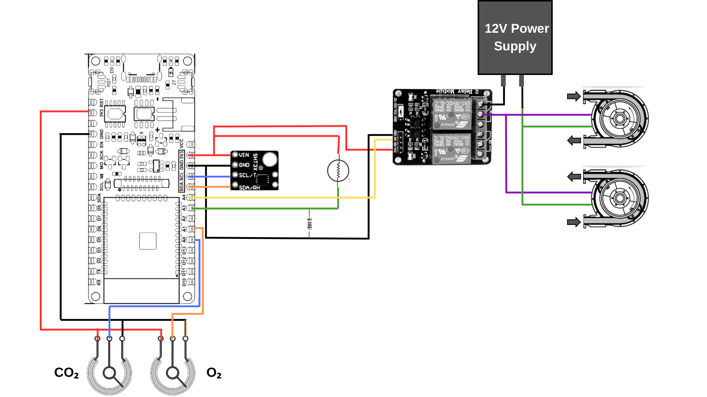

# Agrotech-Final Project- “Cutting-Edge Closed-Environment System for Monitoring Microbial Metabolism and Viability”
## Project Goal :sparkles:
Our goal is to track metabolism indicators by the use of sensors to assess microbial viability within a closed system over time, where a peristaltic pump that refreshes the air once CO₂ concentration reaches a specific threshold.
### Background
The incubator we developed is designed for evaluating the metabolic processes of various microorganisms, including bacteria and algae, with a focus on their respiratory mechanisms. For instance, bacteria that engage in aerobic respiration will exhibit oxygen consumption and carbon dioxide emission. Conversely, algae, which undergo photosynthesis, will absorb carbon dioxide and release oxygen into the environment.

### System Concept
The system is equipped with a range of sensors: CO₂ , O₂ , temperature, humidity, and light intensity to track environmental conditions. Data from these sensors is transmitted to our [Thingspeak Channel](https://thingspeak.com/channels/2595959). When CO₂ levels reach a predefined threshold (1000 ppm, 400-10000 ppm range), The system automatically activates two peristaltic pumps: one to introduce fresh air into the closed environment and another to expel used air, ensuring optimal conditions for precise microbial viability assessment.

### Components:

🔌 Electronics: 

* x1 firebeetle ESP32 microcontroller 
* x1 Relays 
* x2 Peristaltic Pump
* Multiple Cables
* x1 12V Power Source
* x1 CO₂ Sensor
* x1 O₂ Sensor
* x1 LDR (Light dependent resistor)
* x1 Resistor (10K Ω)
* x1 SHT31 Sensor
* x2 Potentiometers

Hardware: 
* x1 Plastic box
  

❗**Disclaimers:** We were able to only monitor, Light, humidity and temperature. CO₂ and O₂ sensors were simulated using Potentiometers and code that set out to “fake” CO₂ and O₂ data.

# Construction:

## Prototype
The initial setup involved integrating various sensors, including the photoresistor and SHT31, with the ESP32 microcontroller to verify basic functionality. To simulate the CO₂ and O₂ sensors, we utilized two potentiometers programmed to generate "fake" CO₂ and O₂ data. This allowed us to control the peristaltic pumps and provide data for presentation purposes. the relays were connected to control the peristaltic pumps. Subsequently, the peristaltic pumps were integrated into the system. Finally, we developed and implemented the code to upload all collected data to ThingSpeak for monitoring and analysis.
The system was assembled on a breadboard to validate the design before integrating it into a more permanent solution.

## Sketch

   
   🔴 **Red** - 3V3
   
   🔵**Blue** - Analog read for sensors
   
   🟡**Yellow** - Analog read for sensors
   
   ⚫ **Black** - GND

   🟣 **Purple** - Relay common terminal (COM)

   🟢 **Green** - SDA/SCL
   
   🟠 **Orange** - VCC 
   
   🟤 **Brown** - 12V power supply 

# Code
We recommend individually testing each code with its corresponding component before integrating the entire system.

🔺 photoresistor [code] 

🔺 SHT31 [code]

🔺 Potensiometers [code]

🔺 Relay [code]

🔺 Peristaltic pumps [code]

🔺 **Intigrated** [code](https://github.com/Gabriella38/Agrotech-Final/blob/main/Code)

# The final outcome

We developed an incubator designed to contain a liquid growth medium with microorganisms and to monitor and measure various parameters and by-products of their respiration over time. This setup provides valuable insights into their biological processes. 
For example, in the case of algae, an increase in O₂ levels and a decrease in CO₂ over time would indicate healthy growth and vitality. Conversely, a slow rate of gas exchange would suggest that the algae are struggling to survive.

## Data analysis
Picture from the Thingspeak:

©️ THE MASTERS
